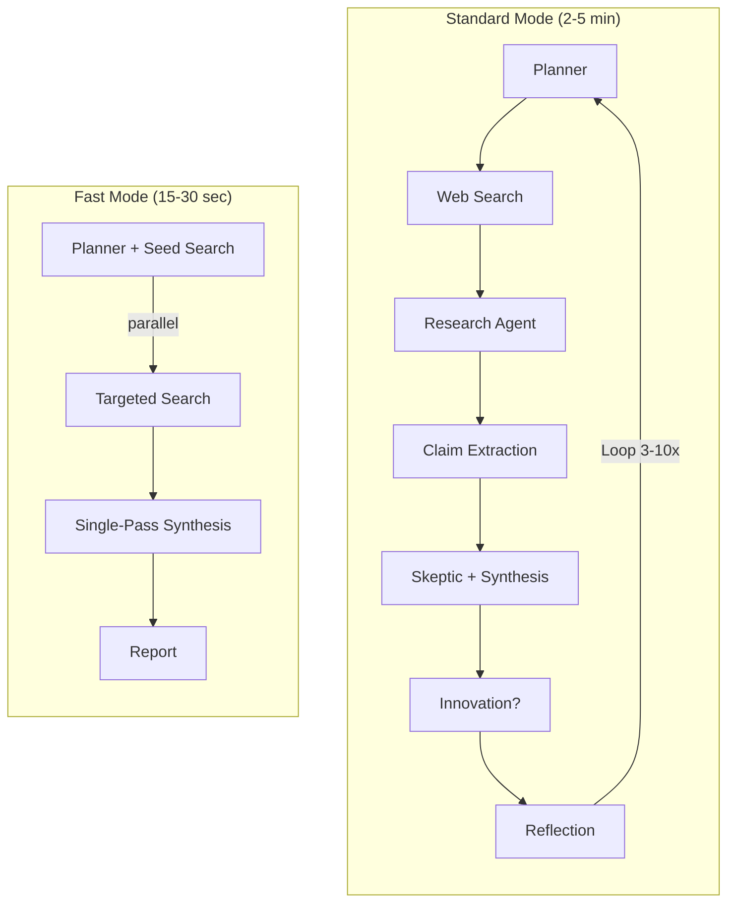
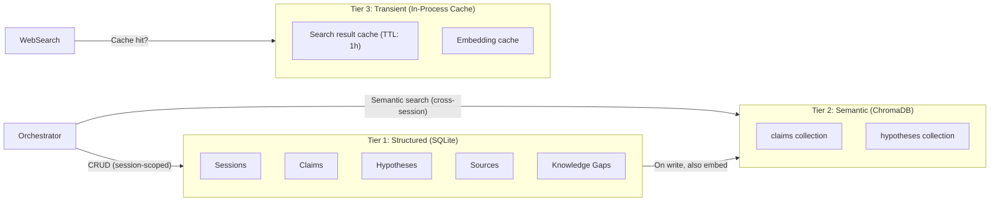

# ARO — Autonomous Research Operator

[](https://opensource.org/licenses/MIT)
[](https://www.python.org/downloads/)
[](Dockerfile)

A multi-agent AI research engine that autonomously plans research strategies, searches the web across 5 free engines, extracts verifiable claims, debates contradictions, synthesizes hypotheses, and generates innovation proposals — with mathematical confidence scoring.

---

## Quick Start

### 1. Clone & Install

```bash
git clone https://github.com/Saptarshi-Nag189/ARO.git
cd ARO

python -m venv venv
source venv/bin/activate        # Windows: venv\Scripts\activate
pip install -r requirements.txt
```

### 2. Configure API Keys

```bash
cp .env.example .env
```

Edit `.env` with your [OpenRouter API keys](https://openrouter.ai/keys). ARO uses 3 free models — you can use a single key for all or separate keys per model:

| Variable | Model | Used By |
|---|---|---|
| `OPENROUTER_API_KEY` | Trinity Large Preview | research, innovation, orchestrator |
| `OPENROUTER_API_KEY_STEP` | Step 3.5 Flash | planner, claim extraction |
| `OPENROUTER_API_KEY_GPT_OSS` | GPT-OSS-120B | skeptic, synthesis, reflection |

> **Tip:** All three models are free on OpenRouter. If you only have one key, set `OPENROUTER_API_KEY` and leave the others blank — ARO will use the default key for all agents.

### 3. Run

**CLI (fastest way to test):**

```bash
# Standard research
python main.py -o "What are the latest advances in quantum error correction?" -m autonomous

# Fast mode (~30 seconds instead of 2-5 minutes)
python main.py -o "Impact of LLMs on software engineering" -m fast

# Innovation mode (prior-art scan + novelty scoring)
python main.py -o "Novel approaches to protein folding prediction" -m innovation -n 5

# Verbose logging
python main.py -o "Your question here" -v
```

**Web Dashboard:**

```bash
# Build the UI (first time only)
cd ui && npm install && npm run build && cd ..

# Start the server
python app.py
# Open http://localhost:5000
```

**Docker (recommended for deployment):**

```bash
docker compose up --build
# Open http://localhost:5000
```

---

## How It Works

ARO runs an iterative research loop where **7 specialized AI agents** collaborate, each powered by the model best suited to its task:

```
Plan → Web Search → Research → Extract Claims → Skeptic → Synthesize → [Innovate] → Reflect → Loop
```

| Agent | Role | Model |
|---|---|---|
| **Planner** | Breaks question into sub-questions with search strategies | Step 3.5 Flash |
| **Research** | Analyzes real web search results, structures findings | Trinity Large Preview |
| **Claim Extraction** | Extracts atomic, verifiable claims with source provenance | Step 3.5 Flash |
| **Skeptic** | Detects contradictions, challenges credibility, flags gaps | GPT-OSS-120B |
| **Synthesis** | Forms hypotheses from validated claims, resolves conflicts | GPT-OSS-120B |
| **Innovation** | Generates patent-grade differentiation proposals | Trinity Large Preview |
| **Reflection** | Meta-analyzes progress, adjusts strategy | GPT-OSS-120B |

### Key Capabilities

- **Real web search** — 5 free engines (DuckDuckGo, Semantic Scholar, arXiv, OpenAlex, Wikipedia), no API keys needed
- **Source provenance** — every claim tagged as `web-sourced` or `training-knowledge`
- **Evidence hierarchy** — peer-reviewed > preprints > Wikipedia > web > training knowledge
- **Cross-session memory** — ChromaDB vector store remembers findings across research sessions
- **Mathematical scoring** — confidence, epistemic risk, and novelty computed per iteration
- **4 research modes** — autonomous, interactive, innovation, and fast
- **Parallel pipeline** — Skeptic ‖ Synthesis and Innovation ‖ Reflection run concurrently (~50s saved over 5 iterations)
- **Response streaming** — token-by-token streaming via SSE
- **Modern React dashboard** — glassmorphism UI with live feed, hypothesis deep-dive, agent network map

### Pipeline Comparison



### Three-Tier Memory Architecture



---

## Modes

| Mode | Description | Speed |
|---|---|---|
| `autonomous` | Fully self-directed iterative research loop | 2-5 min |
| `fast` | Single-pass speculative research (planner + search in parallel) | 15-30 sec |
| `interactive` | Human override at each iteration | Variable |
| `innovation` | Prior-art scan, novelty scoring, patent-grade proposals | 3-7 min |

---

## CLI Options

```
--objective, -o    Research question (required)
--mode, -m         autonomous / interactive / innovation / fast (default: autonomous)
--max-iterations   Max research iterations (default: 10)
--session-id       Custom session ID
--verbose, -v      Debug logging
```

---

## Project Structure

```
aro/
├── agents/                    # AI Agent implementations
│   ├── orchestrator.py           # Pipeline controller (parallel Skeptic ‖ Synthesis)
│   ├── fast_orchestrator.py      # Single-pass fast mode pipeline
│   ├── prompt_builder.py         # Centralized prompt construction
│   ├── data_processor.py         # Source/claim/hypothesis persistence
│   ├── planner_agent.py          # Research planning
│   ├── research_agent.py         # Web search analysis
│   ├── claim_extraction_agent.py # Atomic claim extraction
│   ├── skeptic_agent.py          # Contradiction detection
│   ├── synthesis_agent.py        # Hypothesis formation
│   ├── innovation_agent.py       # Patent-grade proposals
│   └── reflection_agent.py       # Meta-analysis
├── memory/                    # Persistent memory
│   ├── memory_service.py         # Unified facade (guardrails + vector indexing)
│   ├── vector_store.py           # ChromaDB cross-session semantic memory
│   ├── db.py                     # SQLite schema + migration
│   ├── claim_store.py            # Claims CRUD
│   ├── hypothesis_graph.py       # NetworkX hypothesis graph
│   └── source_registry.py        # Source management
├── runtime/                   # Runtime services
│   ├── model_gateway.py          # OpenRouter API (sync + async + streaming)
│   ├── cache.py                  # TTL cache (search, embeddings, LLM responses)
│   ├── event_bus.py              # In-process event system for SSE
│   └── logger.py                 # Structured JSON logging
├── evaluation/                # Mathematical scoring
│   ├── confidence.py             # HypothesisConfidence
│   ├── risk.py                   # EpistemicRisk
│   ├── novelty.py                # NoveltyScore
│   ├── termination.py            # Termination conditions
│   └── metrics_engine.py         # Per-iteration metrics computation
├── tools/                     # External integrations
│   ├── web_search.py             # 5-engine parallel web search
│   ├── prior_art_tool.py         # Prior art scanning
│   └── search_tool.py            # Search abstraction
├── schemas/                   # Pydantic models
├── ui/                        # React + Vite dashboard
├── docs/                      # Documentation
├── app.py                     # Flask web server + /api/health
├── main.py                    # CLI entry point
├── config.py                  # Multi-model configuration
├── Dockerfile                 # Multi-stage production build
├── docker-compose.yml         # Local dev stack
└── requirements.txt           # Python dependencies
```

---

## Deployment

### Docker (Recommended)

```bash
# Build and run
docker compose up --build

# Or manually
docker build -t aro .
docker run -p 5000:5000 --env-file .env aro
```

The Docker image uses:
- **Python 3.12 slim** + multi-stage build (~250MB)
- **Gunicorn** with 4 gthread workers (300s timeout for long research sessions)
- Built-in **health check** at `/api/health`
- Persistent **vector store** volume for cross-session memory

### Health Check

```bash
curl http://localhost:5000/api/health
# {"status":"ok","version":"2.0.0","active_sessions":0,"max_sessions":3,"uptime_seconds":42.1}
```

---

## Environment Variables

| Variable | Required | Description |
|---|---|---|
| `OPENROUTER_API_KEY` | ✅ | Default API key (Trinity Large Preview) |
| `OPENROUTER_API_KEY_STEP` | Optional | API key for Step 3.5 Flash (falls back to default) |
| `OPENROUTER_API_KEY_GPT_OSS` | Optional | API key for GPT-OSS-120B (falls back to default) |
| `ARO_API_KEY` | Optional | Protect `/api/` endpoints (leave empty to disable auth) |
| `ARO_HOST` | Optional | Server bind address (default: `127.0.0.1`) |
| `ARO_PORT` | Optional | Server port (default: `5000`) |
| `ARO_MAX_CONCURRENT` | Optional | Max concurrent research sessions (default: `3`) |

---

## Guardrails

- ❌ No claim insertion without source attribution
- ❌ No hypothesis without supporting claims
- ❌ No innovation without prior-art scan
- ✅ Source provenance tracked (web-sourced vs training-knowledge)
- ✅ Cross-source contradictions detected and resolved
- ✅ Evidence hierarchy enforced across all agents
- ✅ Reasoning traces isolated — never leak into production output

---

## Documentation

- [System Architecture](docs/system_architecture.md)
- [Mathematical Models](docs/mathematical_models.md)
- [Agent Contracts](docs/agent_contracts.md)
- [Reasoning Mode](docs/reasoning_mode.md)
- [Security Policy](SECURITY.md)

---

## License

MIT License — see [LICENSE](LICENSE) for details.
